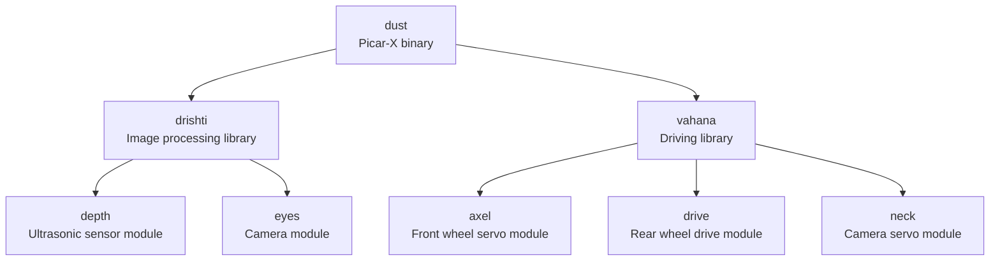

# picars
Autonomous Vehicle using Raspberry Pi and PiCar-X kit created using Rust

# Folder Structure


# Pin Configuration

| Component | Pin (robot-hat) |
| :------- | :--------: |
| mcu_reset_pin | 5 |
| ultrasonic_trig_pin | D2 |
| ultrasonic_echo_pin | D3 |
| left_motor_dir_pin | D4 |
| right_motor_dir_pin | D5 |
| camera_servo_pin1 | P0 |
| camera_servo_pin2 | P1 |
| dir_servo_pin | P2 |
| left_motor_pwm_pin | P12 |
| right_motor_pwm_pin | P13 |


# Code statistics

```python
===============================================================================
 Language            Files        Lines         Code     Comments       Blanks
===============================================================================
 Python                 10         1376         1043          109          224
 TOML                    7           83           59            8           16
 Prolog                  1            8            8            0            0
 Markdown                1           35            0           29            6
-------------------------------------------------------------------------------
 Rust                   14         1774         1276          207          291
 |- Markdown             1            3            0            3            0
 (Total)                           1777         1276          210          291
===============================================================================
 Total                  33         3276         2386          353          537
===============================================================================
```
